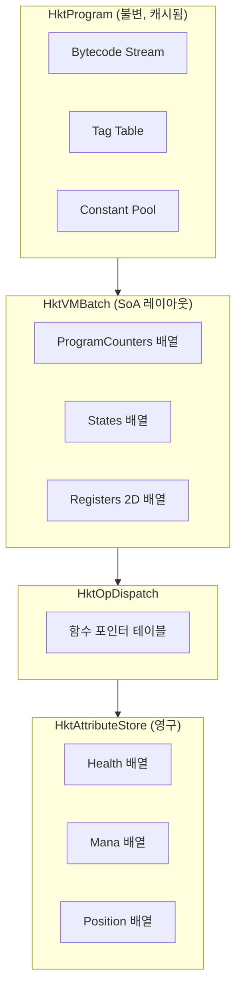
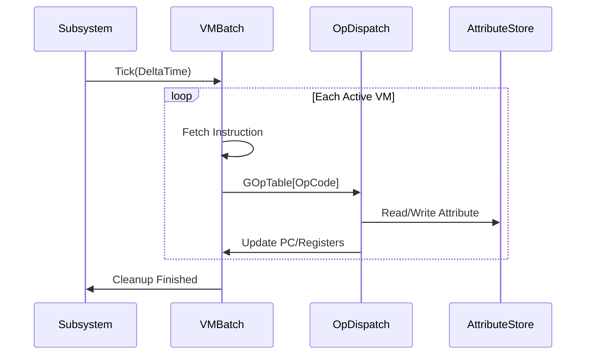

# HktSimulation DOD VM 설계

## 설계 철학: 자연어의 시간-공간

자연어: "파이어볼을 던져서 적에게 맞으면 폭발한다"

- 하나의 연속된 시간 흐름
- 원인과 결과가 선형으로 연결
- 콜백이나 이벤트 분기 없음

기존 프로그래밍의 문제:

```
SpawnFireball() -> SetVelocity() -> OnCollision(callback) -> ApplyDamage()
                                          ↑
                                    시간 공간 단절
```

VM의 해결:

```
SpawnFireball -> MoveForward -> WaitUntilCollision -> ApplyDamage
                                      ↑
                              VM이 시간을 추상화 (Yield/Resume)
                              Flow 작성자는 선형 흐름만 인지
```

**핵심 원칙:**

1. Flow 정의는 자연어 문장처럼 위에서 아래로 읽힌다
2. 모든 비동기 작업은 Yield Point로 처리 (콜백 없음)
3. VM이 시간 복잡도를 흡수, Flow 작성자는 "동작"만 기술
4. 각 명령어는 자연어의 동사/행위에 대응

## 핵심 아키텍처 개요



## 1. 명령어 (무엇을) - Instruction Encoding

### 고정 크기 명령어 슬롯 (8바이트)

```cpp
// 캐시 라인 친화적 - 64bit 정렬
struct FHktInstruction
{
    uint8 OpCode;           // 명령어 종류 (256개 가능)
    uint8 Flags;            // 수정자 플래그
    uint8 Operands[6];      // 피연산자 (레지스터 인덱스, 상수 인덱스 등)
};
```

### 명령어 디스패치 - 함수 포인터 테이블

```cpp
// switch 대신 직접 점프 - 분기 예측 개선
using FOpHandler = void(*)(FHktVMBatch&, int32 VMIndex, const FHktInstruction&);
static FOpHandler GOpTable[256];
```

## 2. 태그 (어떻게) - Tag System

### 프로그램 내 태그 테이블

```cpp
struct FHktProgram
{
    TArray<uint8> Bytecode;
    TArray<FGameplayTag> TagTable;    // 태그 인덱스 -> 실제 태그
    TArray<FHktConstant> ConstPool;   // 상수 풀 (float, vector 등)
};
```

- 명령어에서 태그는 8bit 인덱스로 참조
- `PlayAnimation(TagIndex=5)` -> `TagTable[5] `= `Anim.Mage.FireballCast`
- 런타임에 FGameplayTag 복사 없음

## 3. 분기 (언제) - Branching

### 조건부 점프 명령어

```cpp
enum class EHktBranch : uint8
{
    Jump,               // 무조건 점프
    JumpIfZero,         // 레지스터가 0이면 점프
    JumpIfNotZero,      // 레지스터가 0이 아니면 점프
    JumpIfLess,         // R[A] < R[B] 이면 점프
    JumpIfGreater,      // R[A] > R[B] 이면 점프
    Yield,              // 다음 틱까지 대기
    YieldUntil,         // 조건 충족까지 대기
};
```

### 이벤트 기반 분기

```cpp
// WaitUntilCollision -> Yield 후 조건 체크
Op_YieldUntil: {
    Context.YieldCondition = EYieldCondition::Collision;
    Context.State = EHktVMState::Yielded;
}
```

## 4. 레지스터 (휘발성) - SoA 레이아웃

### VM 배치 처리를 위한 SoA

```cpp
struct FHktVMBatch
{
    static constexpr int32 MaxVMs = 64;          // 캐시 라인 배수
    static constexpr int32 NumRegisters = 16;
    
    // Hot data - 자주 접근
    alignas(64) int32 ProgramCounters[MaxVMs];
    alignas(64) EHktVMState States[MaxVMs];
    alignas(64) float WaitTimers[MaxVMs];
    
    // Cold data - 덜 접근
    int32 OwnerIDs[MaxVMs];
    const FHktProgram* Programs[MaxVMs];
    
    // 레지스터 - 2D SoA (VM별 레지스터)
    alignas(64) FHktRegister Registers[MaxVMs][NumRegisters];
    
    int32 ActiveCount = 0;
};
```

### 레지스터 타입 (64bit union)

```cpp
union FHktRegister
{
    int64 Int;
    double Float;
    struct { int32 EntityID; int32 Generation; } Handle;
    struct { float X, Y; } Vec2;
    uint64 Raw;
};
```

## 5. 속성 (영구적) - External Attribute Store

### SoA 속성 저장소

```cpp
struct FHktAttributeStore
{
    static constexpr int32 MaxEntities = 4096;
    
    // 각 속성을 별도 배열로 (SoA)
    alignas(64) float Health[MaxEntities];
    alignas(64) float MaxHealth[MaxEntities];
    alignas(64) float Mana[MaxEntities];
    alignas(64) FVector Positions[MaxEntities];
    alignas(64) FQuat Rotations[MaxEntities];
    alignas(64) uint32 Flags[MaxEntities];      // 비트마스크 상태
    
    // 생성 카운터 (핸들 무효화 감지)
    alignas(64) int32 Generations[MaxEntities];
    
    // Free list
    TArray<int32> FreeIndices;
};
```

## 파일 구조

[`Plugins/HktGameplay/Source/HktSimulation/Private/Core/`](Plugins/HktGameplay/Source/HktSimulation/Private/Core/)

| 파일 | 역할 |

|------|------|

| `HktVMTypes.h` | 기본 타입, 레지스터, 상태 enum |

| `HktVMProgram.h` | 프로그램 구조체, 태그 테이블, 상수 풀 |

| `HktVMBatch.h` | SoA VM 배치, 레지스터 뱅크 |

| `HktVMDispatch.h` | 명령어 함수 포인터 테이블 |

| `HktVMOps.cpp` | 각 명령어 구현 |

| `HktAttributeStore.h` | 영구 속성 저장소 |

| `HktVMBuilder.h` | 바이트코드 빌더 (Flow용) |

## 실행 흐름



## 주요 설계 결정

1. **고정 크기 명령어 (8바이트)**: 캐시 예측 가능, 인덱스 계산 단순화
2. **함수 포인터 테이블**: switch 오버헤드 제거, 확장 용이
3. **태그 테이블 인덱싱**: FGameplayTag 직접 복사 회피
4. **SoA VM 배치**: 동일 속성 연속 접근으로 캐시 적중률 향상
5. **외부 속성 저장소**: VM과 영구 데이터 분리, 직렬화 용이
6. **64바이트 정렬**: 캐시 라인 경계 맞춤

## 현재 코드 정리

- [`HktSimulationTypes.h`](Plugins/HktGameplay/Source/HktSimulation/Private/Core/HktSimulationTypes.h): 삭제 또는 재작성
- [`HktSimulationBuilder.h`](Plugins/HktGameplay/Source/HktSimulation/Private/Core/HktSimulationBuilder.h): 새 구조에 맞게 재작성
- [`HktSimulationVM.h`](Plugins/HktGameplay/Source/HktSimulation/Private/Core/HktSimulationVM.h): 완전히 대체